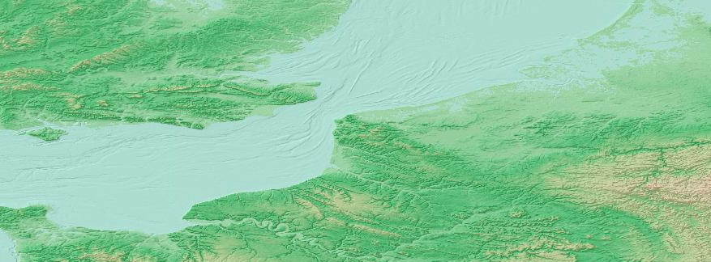
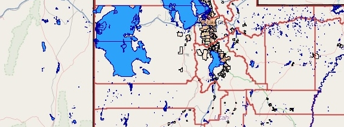
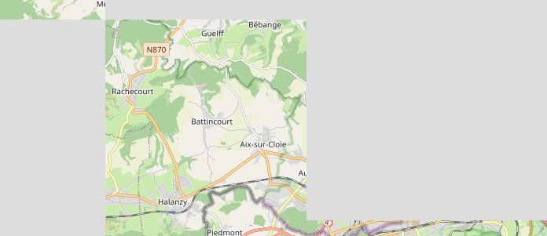
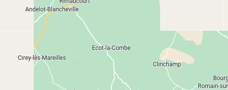
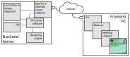
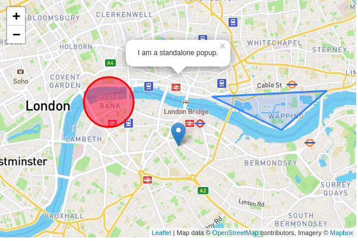
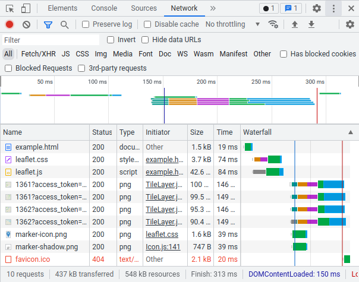
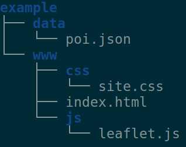
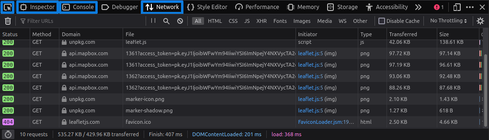
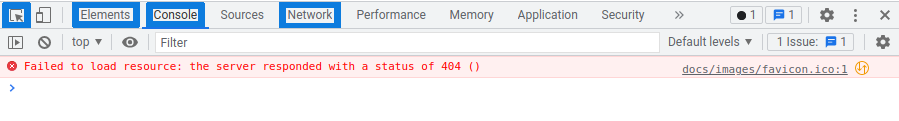

class: 
```{r setup, include=FALSE}
options(htmltools.dir.version = FALSE)
library(xaringanthemer)
```

```{r xaringanExtra, echo=FALSE}
xaringanExtra::use_xaringan_extra(c("tile_view", "animate_css"))
```

# Names, pronouns and the Climate Crisis

.pl[
Let's do a quick round of introductions.

Please let me know your name and pronoun preferences.

*I'm Cyrille, I go by 'he, him, his' pronouns.*
]

.pr[


We must acknowledge the current [climate crisis](https://acknowledge-the-climate-crisis.org/) in our everyday activities.

.source[Global temperature 1850-2020 #ShowYourStripes - Ed Hawkins (University of Reading).]
]

---

# WebGIS subsection outline

.pl[
## The course
The course is divided into four lectures of 2-3 hours of length.

The lesson topics are:

1. WebMap theory, practices and required skills
2. Building simple WebMaps and uploading them to a server.
3. Adding feature types and components to our WebMaps.
4. Making WebMaps more informative.
]

.pr[
## This lesson
  - What are WebGIS and WebMaps?
  - The evolution of WebMaps from static to dynamic
  - Types of map services
  - Limitations
  - How do WebMaps operate?
    - The map stack
  - Skills development
    - File systems, HTML, CSS, JavaScript, Common data formats
  - Developer tools
    - Browser, Coding 
]

???

This course explains the underlying functioning of WebMaps and teaches you how to create them.

Today we will focus on understanding the dependencies of WebMaps, how and what they need to function. As well as what you need to know and understand to create them.

We will start next week with 

---

# Evaluation for this section of the course

.pl[
Each week you will be given tasks.
- They are due before the start of the next lesson
- Depending on our schedule this may mean you have one-two weeks to complete the activities.
]

.pr[
- Each assignment will have points
- Points are summed across all four lessons
- Total percentage contributes to **part** of your overall grade in the course.
]

---

class: inverse, middle, activity
# What is a GIS?

## In pairs determine four or more components of a GIS.

### You have one minute.

---
# A GIS

## Definitions will vary, but ...

.pl[
Typically a GIS consists of 4 hardware and software components:

- hardware (PC/server),
- software,
- data (geographic/spatial), and
- methods (input, manipulation, algorithms, management, query and analysis, or visualization)
]

.pr[
GIS software is typically defined as affording or allowing:

- input and manipulation of geographic information
- database management system (DBMS)
- tools that support geographic query, analysis, and visualization
- a graphical user interface (GUI) for easy access to tools
]

*The ubiquity of computers now makes the hardware requirement a bit obvious and this list dated.

---
# WebGIS or WebMaps

.pull-left[
.tl[
The definition of a WebGIS is vague. esri used to define it in very **technical terms**:
]

- The server has a URL so that clients can find it on the web.
- The client relies on HTTP/S specifications to send requests to the server.
- The server performs the requested GIS operations and sends responses to the client via HTTP/S.
- The format of the response sent to the client can be in many formats, such as HTML, binary image, XML (Extensible Markup Language), or JSON (JavaScript Object Notation).

]

.pr[
In simpler, **human terms**, we could define WebGIS as an online map that allows interaction to change the location, scale and potentially features, as well as creating, editing, removing, and other operations present in a GIS.

There exists within the above definition a wide spectrum of possibility.
]

.source[https://enterprise.arcgis.com/en/server/latest/create-web-apps/windows/about-web-gis.htm]

---
# WebGIS and WebMap differences?


.pull-left[

Within a spectrum of map data:

- there are static maps, those you generate in ArcMap and export as PDF or PNG. While these can be embedded in HTML online or distributed by PDFs they are constrained to the area, scale and features you have selected. These **fulfil many tasks perfectly** where no further affordances are necessary.

- WebMaps provide some level of interaction or even animation, these have become extremely common and practical for providing large data sets that cover large areas with detail where individuals can explore small portions of the data at large scale (small areas). **WebMaps are interactive, allow scaling, panning, and querying.**
]

.pull-right[
- WebGIS are typically built on the same framework as WebMaps but allow some additional operations present in a desktop GIS, such as modifying the data. Note however that that a WebGIS/Map also contain features exclusive to a desktop GIS.
- A desktop GIS, while it may appear as the most powerful way to view and manipulate data, it has certain limitations, such as accessibility.
- WebGIS/Maps provide opportunities that are difficult to implement well or as desired from a desktop GIS. With WebGIS/Maps it is easier to create linkages, customization, real-time collaboration, crowd-sourcing - while a GIS is more suitable for geoprocessing, digitizing, volumetric analysis and many other things.
]

---
# GIS, WebGIS and WebMap
.pl[There isn’t a consensus exactly. So let’s define our own.

**WebMaps are simple interactive maps allowing you to better explore data than with a static map through interactive panning, scaling, and sometimes querying, with readily or easily available base maps.**

**A WebGIS additionally allows you to change data.**
]

.pr[
WebMaps typically provide the following functionalities:
- interactive,
- allow scaling,
- panning,
- accessible through a browser or app,
- inclusion of base maps, and sometimes
- querying of features.
]

???

While we've called this course WebGIS we'll really be learning how to create WebMaps alone according to this definition.

---
class: inverse, middle, activity

# Let's explore

## Go to [this map](https://www.gebco.net/data_and_products/gebco_web_services/web_map_service/mapserv?request=getmap&service=wms&BBOX=45,-3,55,10&crs=EPSG:4326&format=image/jpeg&layers=gebco_latest&width=1600&height=900&version=1.3.0)
## Is this an image or a WebMap?
### Discuss with your neighbour

---
# A WebMap

.pl[
When viewing the map, **explore the URL**.

You should see some parts that make sense:
  - BBOX=45,-3,55,10
  - crs=EPSG:4326
  - format=image/jpeg
  - width=1600
  - height=900
  
Try making changes to the:
- BBOX (location/bounds),
- width & height
- image format (e.g., format=image/png)
]

.pull-right[
.w75[]
- Interaction is difficult and requires expert knowledge (e.g., lat/lng, image w/h distortion)
- While this interface is clunky, there’s still a lot going on in the background on the server. We’ll call what happens on the server the **back-end stack**.

.source[https://www.gebco.net/]
]

---
class: inverse, center, middle, activity

# 10-minute Break

---
# How WebMaps function

.pl[
We've already seen in the earlier exercise how a server has generated an image based on a set of parameters (i.e., bbox, width, height). Let's observe some particularities about the loading of WebMaps to further see how some of them they operate.

**We will explore a couple maps and try to perceive and reveal some of this underlying functionality.**
]

.pull-right[
**Complete the following in pairs.**

[Map/activity 1](http://openwhatevermap.xyz/#3/66.93/14.33) - Three minutes
- What are you conclusions regarding how data is structurally presented to the user?

For the next exercise watch the map as it loads.

[Map/activity 2](http://www.arcgis.com/apps/View/index.html?appid=6f53ca5e2b8c480888e96e5f71929c08) - Three minutes
- Describe what components you see as it loads
- What data does the map contain/present
- What formats (do remember data types from GIS?)
]

---
# Types of Map Services

.pl[
WMS<br>


WFS<br>


.source[https://www.gebco.net/, OSM Contributors, http://www.deegree.org/]
]

.pr[
WMTS/TMS/XYZ (similar)<br>
.w90[]

Tiled WFS<br>


]


???

- WMS (Web Mapping Service): This is similar to what a desktop GIS does, it generates an image of defined bounds and features and displays it to your screen, only this is sent over the internet each time you change scale or pan. This **was** the most commonly used form of WebMaps early on (e.g., the map we saw earlier). Its rare now as it takes processing power and time, making it only worthwhile if there are few requests.
- WFS (Web Feature Service): Provide the vector features to the browser, encoded, to display. This has the added potential of allowing the selective display and styling of client side information (e.g., Google Maps advertising).
- Tiled image maps (WMTS/TMS/XYZ): This was the first big improvement in WMS, allowing much more responsive change in scale and panning. This however is constrained by not containing WFS abilities. There are many standards.
- Vector tiles: It combines the benefits of tiled maps and WFS.

- Note that tile generation can either be done ahead of time or on the fly but that storage becomes and issue as you must save each tile for each resolution.

- The internet has changed, asynchronous vs synchronous (web2.0 in the 2000s)
- Asynchronicity requires a proper server that processes requests.

**No one service is not best for all situations**. Some data is better served in raster format, using tiled images, while others can increase speed and reduce bandwidth with vector formats.
WebMaps can contain combinations of mapping services.

---
# The stack and its components

.pl[
The map services that provide the data are only one (complex) part of the WebMap set of components and data flow. WebMaps depends on a stack of components and sequences of interactions between them.

WebMaps can be broken down into **two** physically separated components - the backend/server and frontend/client:

]

.pull-right[
- The backend is a data service you can query to retrieve data from. Queries are processed to specify the desired data, gathered and formatted for delivery on the server somewhere on the internet. The first example, [the WMS](), is a good representation of the query, the URL, and the resulting data.

- The frontend provides an interactive user interface that translates interactions (mouse zoom & pan) into server requests and displays the results. This happens on your computer/device's app or browser. This interaction is provided by a framework or library that treats all content as equal, regardless of whether it is georeferenced. For example the library can be used to [explore a painting](https://www.haltadefinizione.com/en/viewer/work/selfportrait-umberto-boccioni).
]

---
# The stack

.w100[]

???
## How the backend functions

.pl[
Data services start by receiving a request, a small chunk of instructions defining what someone wishes to retrieve.
- Requests are received by a server (Apache is the name of a service that ‘catches’ requests and directs them to other programs in a structured manner). Based on the request path (the URL’s scheme, domain and paths) or file type (e.g., HTML, PHP) the server will send the different content or other data processing programs.
- If the content is simply HTML (e.g., readable structured text) or an image it will simply return that content.
]

.pr[
- If it is, for example, PHP, it is ‘interpreted’ to complete other actions, such as tell a GIS to process spatial data.
- Databases provided structured data (typically in the form of a table, like an an attribute table) based on queries, they can also provide geographic data.

Any request that requires geographic features stored in a database will have to flow through all these systems and back up to reply to a request, for each request. This is roughly the process that occurs when you visit the example site shown earlier.
]

---
# The frontend and frameworks/libraries

.pl[
  .pr[.ms[]]
We’ll focus on the process of browsers retrieving and displaying WebMap content.

- Let’s use the [Leaflet Library's introductory example](https://leafletjs.com/examples/quick-start/example.html) ([temp link](https://leafletjs.com/SlavaUkraini/examples/quick-start/example.html)) to explore how browsers, web-content and WebMaps interoperate.
- On visiting the site, a request is made to the server to retrieve the HTML page containing textual content and its dependency data and code: formatting/layout/CSS, mapping library/framework, JavaScript/JS, & image tiles.
]

.pr[
.w100[]
]

???

Our interactions with internet content is primarily through browsers. However, we also use other programs, such as apps or a desktop GIS with basemaps to retrieve content from the internet. 

---
# HTML code is free (as in accessible) to learn from

.pl[
**Right click** on the blank/white part of the Leaflet example website and select “View page source”.

The HTML file points to other resources. You can see this in the `<head>` section.
The files are:
- Leaflet JavaScript library provides the WebMap ‘smarts’ (interaction, requests)
- Leaflet CSS determines the layout of the map content.
- Once each of those files are loaded and ‘run’, the browser continues to process the HTML code.
]

.pr[
- End of HTML code contains JavaScript `<Script>` code. This code, using the loaded libraries creates the map. The libraries, based on the given location request the appropriate tiles as defined in the code:

```
    # latitude, longitude, and scale/zoom
    setView([51.505, -0.09], 13);
```
- The remaining code simply adds markers, interaction and information to the markers.

This sort of JavaScript should be somewhat human-readable.
]

???

These resources will be loaded as soon as possible (when your browser ‘sees’ the line) with new requests.

Note these are pointing to another server/domain than that of the HTML file.

---
# WebMap components summary

.lt[
WebMaps depend on a stack of components:
- Servers, directing your request to the applications or resources.
- Server applications, responding to requests and potentially generating images/tiles from the database.
- The network connections bridging you/client to the server.
- The browser, interpreting files for display using a variety of standards, files, and libraries.
 
Within a browser multiple components are combined:
- **HTML** to link all the components together
- **CSS** for layout
- **JavaScript** providing interaction (with users and servers)
- Tiles (WMS) or features (WFS) providing the map backgrounds or content

### Review question
Why would the map provider (MapBox, Google, OSM) use tiled WMS or WFS? Why would you choose one over the other?
]

---
class: inverse, center, middle, activity

# 10-minute Break

---
# WebMap coding requirements, an introduction

.pl[
We will now cover the basics of:

- File systems
- HTML
- CSS
- JavaScript
- Data formats
]

.pr[
There is an enormous amounts of free, good, and accessible information regarding all these concepts on-line.

I will provide an introduction and we will work with these regularly for the next month.

A few resources and practices will be a huge help:
- Your IDE (Notepad++ or Visual Studio Code)
- Keep everything very organized!
- The browser Web Developer Tools
- [Google](https://google.com) is your friend.
]

---
# File systems


.pull-left[
Here are two ways to contact your room-mate 'Tom':

.pr[.ms[.w75[]]]
1. You mail them a letter by writing the full address on an envelop and putting it in an outgoing mailbox. 

2. You simply put their name on the envelope and place it in **your** mailbox.

.pr[.ms[.w75[]]]
But if you leave the envelop at your friend’s house, it won’t reach the correct person.

.source[Unknown, unknown]
]

.pr[
In order to work with HTML, CSS, JS and data we need to understand how they are linked.

This is typically done through ‘paths’ that are either:
- relative, or
- absolute

This issue has likely been problematic for you when using a GIS at some point.
]

---
# File paths examples

.pull-left[
.pr[]
## Relative Paths
- index.html
- /css/site.css
- /js/leaflet.js
- ../data/poi.json
- **Where am I?**

## Absolute Paths
- https://wwwen.uni.lu/
- https://wwwen.uni.lu/studies/fhse/master_in_geography_and_spatial_planning/programme
- https://wwwen.uni.lu/research/fhse/dgeo
]

.pr[
## Question
How are your MAGEO course files organized?

Come to the board and draw your generalized folder and files tree.
]

---
class: inverse, center, middle, activity

# Activity

Working with a partner:

[Download](https://github.com/serialc/webmaps_introduction/blob/main/rsrcs/l1/filepaths/ex1.zip?raw=true) this file.

**Extract/unzip it!**

Repair the paths/folders so the Leaflet example from before functions.

*Follow the bread crumbs starting from the index.html file*

---
# Introduction to HTML

.pull-left[
These are tags and they usually come in pairs:
```{html}
<html>
  <head>
    <title>My website</title>
  </head>
  <body>
    <div>Content</div>
  </body>
</html>
```
<hr>

Different tags provide certain functionalities by default.
- `p` - Creates margins above/below the contained text.
- `div` - Contains content in a box that fills the width.
- `script` - Expects JavaScript within.
- `style` - Expect CSS within.

]

.pull-right[
Tags can contains attributes. In this case the attributes are named **class**, **id** with values **pop**, **map**:
```{html}
<p class='pop'>Hi</p>
<div id='map'></div>
```
<hr>

In the above case we would say the paragraph **has** the class 'pop' rather than speak of attributes and values.

Similarly, the div tag **has** the id 'map'.

**Note that classes are meant to be applied to MANY elements, but id names should be UNIQUE.**
]

???

HTML links to CSS, JavaScript, images, libraries, and other items. Typically it contains the textual data/content. HTML links to other resources, which may link to further resources downloaded when the page is loaded. Additional data can be asynchronously loaded - such as the WebMap tiles as you pan around.

**If you want to make a WebMap that means you want to put content on-line on a website.**

---
# HTML Example

.pl[
Let's look at a larger HTML example:
]

.pull-right[.ts[
```{html}
<!DOCTYPE html>
<html>
  <!-- I am a comment. Browsers ignore me -->
  <head>
    <meta charset="utf-8">
    <title>WebGIS maps</title>
  </head>

  <!-- Start of the body, where the content should be placed -->
  <body>
    <h1>My WebMaps</h1>
  
    <h2>Me</h2>
    
  
    <h2>Maps</h2>
    <p>Here are some WebMaps I made:</p>
    <ul>
      <li>
        <!-- This is a link, using the 'a' tag -->
        <a href="pages/first.html">Map of water sampling</a>
      </li>
      <!-- Add other links and descriptions here using the above as an example -->
    </ul>
  </body>
</html>
```

]]

???

In some cases you can’t share a WebMap as easily as you can an image map that you could post on Twitter, Facebook, etc… You will need to have a basic understanding of HTML, and other aspects, in order to do so.

---
# Introduction to CSS (Cascading Style Sheets)

.pl[
CSS contains styling and layout information for HTML.

Before CSS, existing styling would be embedded/mixed in HTML, this would make changing design or content a lot more work.

The benefits of CSS are clear. See the [CSS Zen Garden](http://www.csszengarden.com/), **one HTML content file** with different CSS files.
]

.pr[
.w90[]
]

---
# CSS
 
.pull-left[
CSS can either be placed in an independent file or within the HTML file.
- Link to the CSS file within the existing `<head></head>` section:
```{html}
<link href="css/webmap.css" rel="stylesheet" type="text/css"/>
```
]

.pull-right[
- Add it in the HTML within a set of `<script></script>` tags:
```{CSS}
/* CSS comments are different than HTML */
/* The 'a' points/links to an HTML elements of type 'a' */
a {
  text-decoration: none;
}
/* The '#' points/links to an HTML element with a an id of 'map' */
#map { 
  position:absolute;
  top:0; 
  width:100%
}
/* The '.' points/links to all HTML elements with a class of 'pop' */
.pop {
    font-size: 1.2em;
    font-weight: bold;
}
```
]

???

A reminder that HTML contains content, CSS should make the layout and styling.

While it's possible to embed the CSS in the HTML, I recommend keeping it in a separate file.

Note that the order in which CSS rules are read impacts them.
So if the class 'pop' defines twice what colour it should be, only the second rule will be followed.

---
# Introduction to JavaScript

.pl[
JavaScript is a scripting programming language (doesn't need further processing to be used). 

It’s powerful but very easy to create confounding errors/unexpected results.

JavaScript is used in this course to to 'create' maps, load content and handle interaction/requests.
Most of the complexity is hidden using libraries and we will  mainly be doing configuration.
]

.pull-right[
Create a variable/container and label it with:
- `let` or `var`

```{js}
let map = L.map('map').setView([51.505, -0.09], 13);

let options = {
	maxZoom: 18,
	attribution: 'Map data &copy; <a href="https://www.openstreetmap.org/copyright">OpenStreetMap</a> contributors, ' +
		'Imagery © <a href="https://www.mapbox.com/">Mapbox</a>',
	id: 'mapbox/streets-v11',
	tileSize: 512,
	zoomOffset: -1
};

let tiles = L.tileLayer('https://api.mapbox.com/styles/v1/{id}/tiles/{z}/{x}/{y}?access_token=pk.eyJ1IjoibWFwYm94IiwiYSI6ImNpejY4NXVycTA2emYycXBndHRqcmZ3N3gifQ.rJcFIG214AriISLbB6B5aw',
  options).addTo(map);
```

]

???

JavaScript is quite readable, try and figure out what people are doing, copy and change as needed. JavaScript does have it’s problems though - there are good and bad parts. 

---
# Data formats

.pl[
While some web applications allow uploading of esri shapefiles and tables, most WebMaps require data in JSON/GeoJSON format or structured/table text format (e.g., CSV, TSV, etc.).

We'll only work with JSON, GeoJSON, and structure data files (e.g., CSV) of these.
]

.pull-right[
## JSON

JSON is a very human and machine readable way of storing many data types that can used directly from JavaScript code.

```{js}
{
  "squadName": "Super hero squad",
  "homeTown": "Metro City",
  "formed": 2016,
  "secretBase": "Super tower",
  "active": true,
  "members": ["Molecule Man",
              "Madame Uppercut",
              "Eternal Flame" ]
}

```

.source[[Mozilla](https://developer.mozilla.org/en-US/docs/Learn/JavaScript/Objects/JSON)]
]

---
# A deeper understanding
.pull-left[
Don’t be too worried about memorizing all this now. Focus on being able to understand it. You can always replicate by copying and modifying.

**The biggest greatest importance is understanding the linkage between folder/files and how they relate to html, css, js, and other data files.**

While IDEs can be helpful, there are tools built into web browsers to better **understand** how things function and what may be going wrong.

You will encounter problems. Without these (debugging) tools it is difficult to understand where the problem lies.
]

.pr[
<iframe width="560" height="315" src="https://www.youtube.com/embed/F7IZZXQ89Oc?rel=0" frameborder="0" allowfullscreen></iframe>
.source[Spinal Tap]
]

---
# Developer Tools

.pull-left[
Most browsers have developer tools. These can be enabled in a variety of ways depending on your computer and browser. Try the following:

- PC/Linux - `Ctrl+Shift+I`
- Mac - `Alt+Command+I`
- F12
- Tools -> Web Developer Tools* 


Firefox developer tools.
]

.pull-right[
The are four tabs that are of importance for us:

- The **Pick** tab/button allows you to focus in individual elements.
- The **Inspector/Elements** tab allow you to browse the HTML source code and understand how elements are constructed.
- The **Console** tab is where JavaScript information is provided, such as errors, warnings, or just text to help the developer debug/check their code.
- The **Network** tab shows us what/who the browser is communicating with and what it is sending and receiving (or failed receiving).


Chrome developer tools.
]

???

* Or some similar combination of menus.

---
# Revisited

.pull-left[
## Leaflet Example
Let’s reconstruct the how the [Leaflet example site](https://leafletjs.com/SlavaUkraini/examples/quick-start/example.html) generates a WebMap by using the Developer tools.

- Open the Developer tools
- Look at the Network tab, you will need to refresh the page to see what/how the page loads.

<hr>

## Airports and flight Paths
Let’s revisit the [airports and flight paths map](https://www.arcgis.com/apps/View/index.html?appid=6f53ca5e2b8c480888e96e5f71929c08) again but using Firefox/Chrome's developer tools:
]

.pull-right[

- Look at the downloaded tiles in the network tab. Specifically note their sources.
    - Click the item to gain more information in a side panel.
    - Note that tile  URL paths vary. These are the X, Y tile coordinates and Z is the zoom level.
    - Tip: Use the Clear tool (garbage can/bin) on the network tab to clear past network requests.
- By hovering over the file name in the main network tab you can preview the file. Go through a few/many, you should see there are multiple types. How many types of tiles do you see? What strategy is the map using to display content?
- Using the element selector/pointer, the left-most tab, try to select some of the map features. What can you deduce from this? How are the circle/paths features different?
]

---
class: inverse, center, middle, activity

# A few points before we close for today

---

# WebMaps usually exist in context

.pl[
WebMaps should typically be used in a context, such as figures and tables in a document.

Some examples:

- [Coronavirus in the U.S.](https://www.nytimes.com/interactive/2021/us/covid-cases.html)
- [Global Map of 2021 PM2.5 concentrations](https://www.iqair.com/world-air-quality-report)
- [Black snow: Sugar cane burning Florida](https://projects.propublica.org/black-snow/)
- [Ukraine-Russia war](https://www.hrw.org/news/2022/03/18/ukraine-deadly-attacks-kill-injure-civilians-destroy-homes)
- [Russian invasion of Ukraine](https://ig.ft.com/russias-war-in-ukraine-mapped/)
]

.pr[
Some WebMaps can contain the totality of the content, mostly in a map. These are okay but are either embedded within apps or often more fun novelties or proof of concepts:

- [London Planning Datamap](https://apps.london.gov.uk/planning/)
- [Weather Goldilocks zone](https://lukechampine.com/goldilocks/)
- [Experiment linking maps](https://vannizhang.github.io/optica/dist/#center=5.946,49.504&layout=vertical,3&zoom=12,14,16)
]

---
# Limitations of WebMaps

.pull-left[
A drawback of WebMaps is that they can depend on a variety of software and data frameworks which change - unlike a static map. While I have created many WebMaps, I stop maintaining them when no longer relevant. As a result they eventually no longer function perfectly or at all.

- [Bike-share rebalancing](https://bikeshare-research.org/rebalancing/webmap/) - Broken base map.
- [Safe Streets Trafford](https://serialc.github.io/Safe-Streets-Trafford-Explorer/) - Broken double slider/brush.

We will learn more about these components, but keep in mind that as browsers (part of the client or front-end stack), mapping libraries, data providers (e.g., Mapbox) evolve, these may break the functionality of your maps.
]

.pull-right[

When choosing components for your professional projects in the future this may be very important. Selecting the right combination depends on:

- acceptable cost, 
- data type and quantity, 
- necessary or desired features,
- configuration expertise, 
- ability to use independent data (base maps in particular),
- user and medium (PC vs phone or tablet), and
- other factors …
]

---
# Development tools

.pl[
We will need to write and edit HTML, CSS, and JavaScript **code**.

**Computers are are very picky about details when reading code**. A stray bracket or typo can break functionality and sometimes be *very frustrating* to resolve.

Some programs help you code by indicating when there's problems and assuring that connections between files, such as HTML to CSS, are correct and will give you a warning. These are called integrated development environments (IDE).
]

.pr[
I believe you can get sufficient support using [Notepad++](https://notepad-plus-plus.org/) but some students in the past have greatly appreciated using [Visual Studio Code](https://code.visualstudio.com/) by Microsoft.

Many other [alternatives exist](https://www.google.com/search?q=ide+for+web+development).

Feel free to use either or both as you wish, however I believe only **Notepad++** is available on the lab machines.
]

---
# Homework for next week

.tl[
1. [Computer Science Basics with Minecraft](https://studio.code.org/s/mc/lessons/1/levels/1) - Provide a screenshot of your code for the last level.

2. [JavaScript basics](https://developer.mozilla.org/en-US/docs/Learn/Getting_started_with_the_web/JavaScript_basics) - Follow the instructions.

3. Browse the other sections of the [MDN site](https://developer.mozilla.org/en-US/docs/Learn/Getting_started_with_the_web), perhaps related to HTML and CSS.

4. Using what you've learned and the code examples given, create a very simple website, it doesn't need to be pretty, introducing yourself and including a small picture of yourself. Zip up your site.

5. Email the results of step 1 & 4 to me **before** next week's lesson.
]

---

# Questions?

## [Contact me](mailto:cyrille.mdc@liser.lu) if you have any questions.
