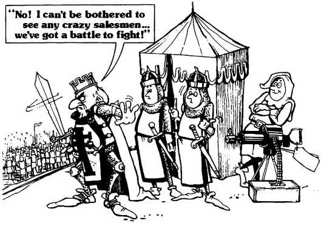

class: 
```{r setup, include=FALSE}
options(htmltools.dir.version = FALSE)
library(xaringanthemer)
```

```{r xaringanExtra, echo=FALSE}
xaringanExtra::use_xaringan_extra(c("tile_view", "animate_css"))
```

# Everything looks like a nail

.pl[
Before making a WebMap, questions to ask yourself:

- Is the concept/idea valid? Does it makes sense cartographically to compared to a static map? 
- What is the best medium to communicate your data?
- Do not think all maps are best shared using WebMaps
]

.pr[


.source[[McCullen, 2018](https://medium.com/thethursdaythought/when-all-you-have-is-a-hammer-everything-looks-like-a-nail-the-einstellung-effect-on-67ee8449f740)]
]

---
# Valid WebMap applications

.pl[
WebMaps are great for exploring or communicating data that necessitate changing scale, area and comparing data to general spatial features (base maps) to comprehend.

To take an example from last lesson, the airline flights example is quite a good example of this. You can focus on an individual airport, specific regions (e.g., Greenland vs Africa) or the world.
If I wanted to improve that map I could make it that clicking on an airport highlights those flights in particular.
]

---

# WebMap pyramid of requirements

.tl[
The skills required for WebMap development

- Need to be able to use a computer.
- Understand absolute/relative paths of file structure.
- Understand how WebMaps function and where data is stored.
- Have some cartographic basics.
- Understand some **JS, CSS and HTML** basics.
- Be able to generate and export GIS data.
- Understand some basic data types.
]

???

Last week had some technical background taking time last week, but it’s necessary, and while we will be making WebMaps this week, we’ll continue to use the knowledge from last week and develop new skills.

---
# Agenda for Lesson 2

.tl[
1. Uploading your web page from last week to the server
2. Understanding our WebMap template for all WebMaps
3. Creating our first WebMap of Luxembourg POI
4. Creating a WebMap of flight paths from Luxembourg
5. Uploading all our WebMaps to the serve
]

---

class: inverse, center, middle, activity
# Section/activity divider

.tl[
larger text

]

---

