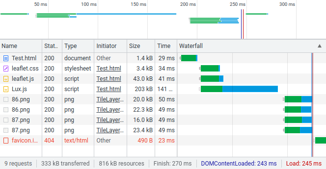
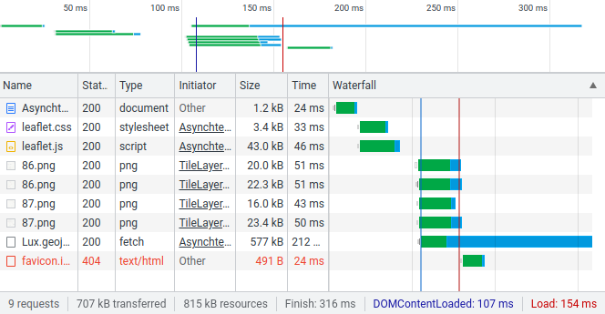
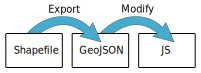
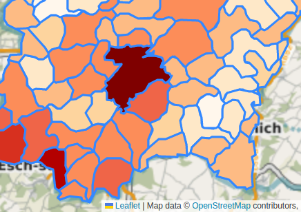

class: 
```{r setup, include=FALSE}
options(htmltools.dir.version = FALSE)
library(xaringanthemer)
```

```{r xaringanExtra, echo=FALSE}
xaringanExtra::use_xaringan_extra(c("tile_view", "animate_css"))
```

# Lesson 3

.pl[
## Agenda
- Debugging a WebMap
- Adding external data
- Creating a legend
- Creating an interactive information panel
]

.pr[
## Homework reminder

Homework is due before the next class.
So today's lesson's class and homework is due next week.

]

---
# More data please

.pl[
So from last weeks homework you could replicate the Leaflet tutorial and add additional markers and circles to the WebMap by duplicating the provided code:

```{js}
// A marker
var marker = L.marker([51.5, -0.09]).addTo(map);

// A circle
var circle = L.circle([51.508, -0.11], {
    color: 'red',
    fillColor: '#f03',
    fillOpacity: 0.5,
    radius: 500
}).addTo(map);
```
]

.pr[
You also saw how to add **popups** to markers or points, but really any leaflet feature (e.g., marker, polygon, line):

```{js}
// continuing from previous code
marker.bindPopup("I am a marker.").openPopup();
circle.bindPopup("I am a circle.");
```

But what if we have a lot more data, for example exported from a GIS?
]


---
# Adding external data

.pl[
Aside from manually copying the code repeatedly, like for last week's homework and the last slide, there are **two more effective ways** to load data sets into Leaflet:

1. **Asynchronously** - this will load the data when needed but requires `fetching` it in your JS code. This is the cleaner and better option.
2. **Synchronously** - this requires a bit of prep, transforming the GeoJSON file to JS, and linking the data in our `<head></head>` just as we linked JS files.
]

.pr[
While we can import CSV data as well, we'll focus on GeoJSON data.

In your [resource file](l3/lesson3.zip) for this week, you'll find a folder named LuxPopulation and one data set in three formats:

- Shapefile
- GeoJSON
- JS

The JS and GeoJSON files are **almost** identical.
]

---
# A/Synchronously loading

.pl[
## Synchronous loading


]

.pr[
## Asynchronous loading

]

---
# Converting between data formats

Converting from shapefile to GeoJSON is only a matter of exporting it from your GIS of choice.

As noted on the last slide converting from a GeoJSON file to a JS requires a **minor** intervention.

.w100[]
---
# Comparison of JS code & GeoJSON data

JS came first (1993) and provided a way to contain data in the code, but eventually people needed a format to store and transfer data with outside of JS code, so they created the JS Object Notation (JSON) (2001) and later (2008) a specific structure of JSON for geographic data named [GeoJSON](https://geojson.org/). Here's the same data contained in JS file and GeoJSON:

.pull-left[
## dinagat.js
```{js}
var islands_location = {
  "type": "Feature",
  "geometry": {
    "type": "Point",
    "coordinates": [125.6, 10.1]
  },
  "properties": {
    "name": "Dinagat Islands"
  }
};
```
]

.pull-right[
## dinagat.geojson
```{js}
{
  "type": "Feature",
  "geometry": {
    "type": "Point",
    "coordinates": [125.6, 10.1]
  },
  "properties": {
    "name": "Dinagat Islands"
  }
}
```
]

Note the minor differences between the two.

---
# Synchronously - Adding JS GeoJSON data

.pl[
To now use this GeoJSON data in a JS file with Leaflet we first need to link it to your HTML document.

In the `<head></head>` section I simply add:
.ts[
```{html}
<!-- obviously change the name of the file to match -->
<script src="dinagat.js" type="text/javascript"></script>
```
]

You can now use the data in your main JS code by simply referring to the **data variable** name defined in the **dinagat.js** file named **islands_location**.
]

.pr[
In the previous lesson you used Leaflet methods (e.g.,   L.marker, L.circle, L.polygon) to create features.

Similarly, you can create and add **all** the features in the GeoJSON data (within the JS file) to the map:

```{js}
// after I have created my map
L.geoJSON(islands_location).addTo(map);
```

So while in this case the data contains only one data point, if the JS file's GeoJSON contained many features, they would all appear with this simple line of code.

]

---
# Asynchronously - Loading the GeoGJSON

.pl[
For this method you can directly use the GeoJSON data file (potentially export from your GIS). This method is more robust and doesn't require us fiddling with data file internals (i.e., convert GeoJSON to JS).

All that is required is, after the Leaflet map has been created, is request that the JS fetch the data and display it:

.ts[
```{js}
fetch("dinagat.geojson")
  .then(function(response) { return response.json(); })
  .then(function(data) { L.geoJSON(data).addTo(map); });
```
]
]

.pr[
All these lines do is request the file, indicate how to process the data type (JSON), and then add it to the map.

You could expand this farther if you wish to do further work with the data after receiving it:

.ts[
```{js}
fetch("dinagat.geojson")
  .then(function(response) { return response.json(); })
  .then(function(data) {
    L.geoJSON(data).addTo(map);
    // do other things with the data
  });
```
]

]

---
# The asynchronous catch

.pl[
It appears that the asynchronous methods is remarkably simpler, but **there's a catch**.

The `fetch` command makes a request that only a server can understand. Not your normal Windows installation.

This means, in the context of this course, that you are not able to test this on your local machine and **you must upload your code to the server with FileZilla to test your asynchronous code**.
]

.pr[
## Pros & Cons
It's much better to use the asynchronous method to reduce page loading time and only load the data the user asks for. It also requires less fiddling (GeoJSON -> JS conversion).

In the context of this course however, the synchronous method allows easier testing.

Loads data:
- Synchronous - at the start of the page load
- Asynchronous - when and if necessary
]

---
class: inverse, center, middle, activity
# Activity 1 - Add external data

.pl[
Using the WebMap code templates from [last week](rsrcs/l2/lesson2.zip) (resources/A_tale_of_two_codes), your task is to create two WebMaps of Luxembourg's communes using the [data provided](rsrcs/l3/lesson3.zip).
- One using synchronous loading (the JS file)
- One using asynchronous loading (fetching the GeoJSON)
]

.pr[
While I provide the data in shapefile, GeoJSON and in JS format, please start with the shapefile and see if you can convert it correctly through to GeoJSON and to JS.
]

---
# Processing data

.pull-left[
We now have the ability to add larger quantities of data to a WebMap.
Just like with a GIS, we typically want to style features differently based on attribute values.

**So**, it's possible to style all your features in the same manner:
```{js}
let styling = {
  "color": "blue", // of polygon fill
  "weight": 2, // of line thickness
  "opacity": 0.5 // of polygon fill
};
 
// note the added 'styling' and brackets
L.geoJSON(data, {
  style: styling
}).addTo(map);
```
]

.pull-right[
**But** we want to make each polygon a colour based on an attribute value:

.ts[
```{js}
L.geoJSON(data, {
  style: function(feature) {
    // Note the N2013 - this is the attribute name!
    mapval = feature.properties.N2013;

    if(mapval > 35000) return {fillColor: '#7f0000', fillOpacity: 1};
    if(mapval > 30000) return {fillColor: '#b30000', fillOpacity: 1};
    if(mapval > 20000) return {fillColor: '#d7301f', fillOpacity: 1};
    if(mapval > 10000) return {fillColor: '#ef6548', fillOpacity: 1};
    if(mapval > 5000) return {fillColor: '#fc8d59', fillOpacity: 1};
    if(mapval > 3000) return {fillColor: '#fdbb84', fillOpacity: 1};
    if(mapval > 2000) return {fillColor: '#fdd49e', fillOpacity: 1};
    if(mapval > 1000) return {fillColor: '#fee8c8', fillOpacity: 1};
    if(mapval > 500) return {fillColor: '#fff7ec', fillOpacity: 1};
    if(mapval > 0) return {fillColor: '#ffffff', fillOpacity: 1};
  }
}).addTo(map);
```
]

]

???

There's other ways to do this - but I'm trying to keep things simpler.

See the Leaflet documentation on [choropleth maps](https://leafletjs.com/examples/choropleth/) for more information.

---
# Results

.pl[
### No classification
.w100[]
]
.pr[
### Classification
.w100[]
]

---
class: inverse, center, middle, activity
# Activity 2 - Creating a choropleth map

.pl[
Create the WebMap above showing Luxembourg communes coloured differently based on their population (a choropleth map).

This uses the same data as Activity 1. It's simpler for testing here to use your **synchronous** WebMap from the last activity.
]

.pr[
When choosing colours yourself I recommend using a colour generator such as [ColorBrewer](https://colorbrewer2.org/#type=sequential&scheme=YlGnBu&n=5)
]

---

# Making WebMaps legendary

.pull-left[
Legends are an important part of maps and WebMaps are no different. 
Leaflet makes adding controls, sort of like panels, to the map easy.

```{js}
// add the panel at a position
let legend = L.control({position: 'bottomright'});

// when adding it, do the following
legend.onAdd = function (map) {

  let div = L.DomUtil.create('div', 'legend panel');
  div.innerHTML += 
  '<div><i style="background: #7f0000;"></i> <span>&gt;36,000</span></div>' +
  '<div><i style="background: #b30000;"></i> <span>35,000 - 30,000</span></div>' +
  // and a few more
  '<div><i style="background: #ffffff;"></i> <span>500 - 0</span></div>';

  return div;
};

legend.addTo(map);
```
]

.pull-right[
Almost done, we need a bit of CSS to make it pretty.

```{css}
.legend {
  line-height: 18px;
}
.legend i {
  width: 18px;
  height: 18px;
  float: left;
  margin-right: 8px;
}
.panel {
  background-color: white;
  padding: 6px;
}
```

We should now have a legend appear at the bottom right of our WebMap.

.source[https://leafletjs.com/examples/choropleth/]
]

---
class: inverse, center, middle, activity
# Activity 3 - Adding a legend

.pl[
Add a simple legend to your Luxembourg population map.

You don't need to add all the classes, just 3 or so to show it functions.
]

---
# Adding an interactive information panel

.pull-left[
The final step, and one of the reasons for using WebMaps over static maps,
is their ability to to be interactive.

This will show you howt to add another
control panel, but rather than display a legend we'll display attribute data
sort of like the popups but in one location.

Let's start by creating another control for information:
```{js}
let infopanel = L.control({position: 'topright'});
infopanel.onAdd = function (map) {
  let div = L.DomUtil.create('div', 'panel');
  div.innerHTML += '<div id="details">Place your cursor over a commune for details</div>';
  return div;
};
infopanel.addTo(map);
```

The information panel should now be visible, but not interactive.
]

.pull-right[
To add interactivity:
```{js}
function overAction(e) {
    let f = e.target.feature;
    document.getElementById("details").innerHTML =
      "<h3>" + f.properties.NAME_3 + "</h3>" +
      "<p>Population 2013: " + f.properties.N2013 + "</p>";
    console.log(f.properties);
};

L.geoJSON(data, {
  onEachFeature: function(feature, layer) {
    layer.on({
      mouseover: overAction
    });
  },
  style: // styling code from earlier was here
});
```
]

???

Explain in detail the code sections.

Source or for more information see: https://leafletjs.com/examples/choropleth/

---
class: inverse, center, middle, activity
# Activity 4 - Adding an information panel

.pl[
Follow the directions in the earlier slide to add an information panel that provides the name of the commune and the population.

Note that you **need to be careful where you add the code!**
]

---

# Homework

.pl[
## Exercises
Finish the four exercises from today's lecture.
- Create two WebMaps loading data in synchronously and async.
- Create a synchronously data loading choropleth map of Luxembourg's population
- Add a legend to the choropleth WebMap
- Add a information panel to the choropleth WebMap
]

.pull-right[
## Replication
Your homework assignment for next week is to create a similar map to the Luxembourg Population map,
but with content/data of your choice.
Please provide:
- a Legend
- an information panel
  
**Upload** the three WebMaps to your server space:
- The simple asynchronous WebMap
- Luxembourg population WebMap with legend and information panel
- Your independent WebMap with legend and info panel
- Update your main index.html to point to all your WebMaps
]
